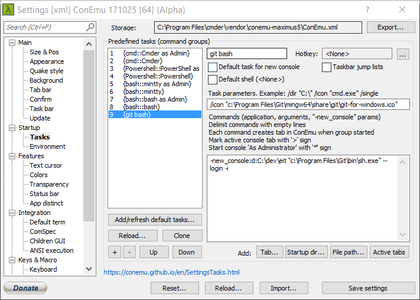
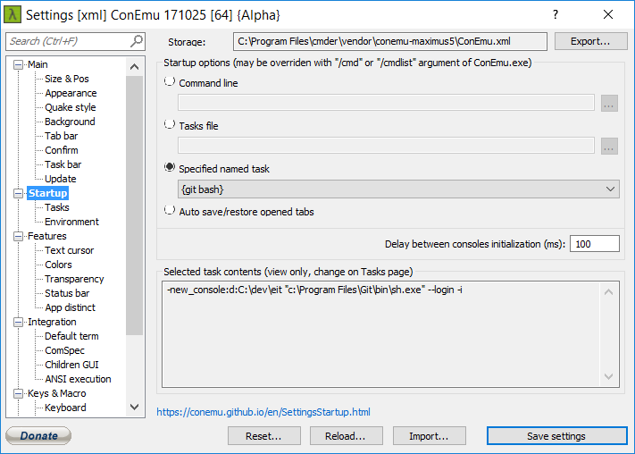

I use Windows machine in my job and was always angry at defaut `Command Prompt`. After some searching here and there, I found excellent [Cmder](http://cmder.net/). 

These days, Git is everywhere and there is [Git for Windows](https://git-scm.com/download/win) which installs Git Bash.
Git Bash is a package which contains Unix tools such as `awk`, `cat`, `curl`, ... compiled against Windows API.

I thought it'd be excellent to start `Cmder` with Git Bash by default and enjoy Unix tools without any hassle. 

Here is the result:

I created new task called `git bash`, added _Task parameters_: `/icon "c:\Program Files\Git\mingw64\share\git\git-for-windows.ico"`, added _Command_: `"c:\Program Files\Git\bin\sh.exe" --login -i` and clicked _Startup dir..._ button and navigated to my desired startup dir what resulted into `-new_console:d:C:\dev\eit` being prepended in front of command.

I also set git bash task as `Startup` task:

